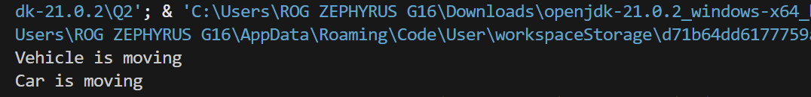

outputnya yang pertama yaitu Vehicle is moving itu sudah benar karena dia memanggil method move() dari class Vehicle dan output kedua yaitu car is moving kenapa bisa begitu itu karena meskipun variable v2 mendeklerasikan sebagai tipe Vehicle dia menunjuk ke sebuah objek car dan karena class car melakukakan override pada method move() jadi class car menimpa atau menggantikan fungsi asli dari vehicle
maka dari itu saat menjalankan move() java akan melihat bilang ini object aslinya car. jadi car punya versi tersendiri untuk melakukan method move(). karena itu java menjalankan move() dari car bukan dari dari vehicle