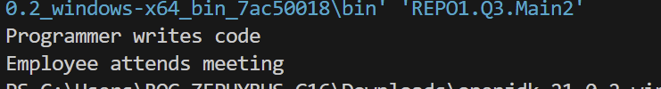

output pertama yaitu programmer writes code kenapa bisa? itu karena Programmer melakukan override pada saat e.work()terjadi override. walau variable e tipe imployee tapi java tetap melihat objek aslinya sebagai programmer. dan karena class programmer memiliki implementasi sendiri untuk work(). maka dari itu subclass yang dipanggil
output kedua yaitu Employee attends meeting kenapa bisa? karena pada class Programmer tdk melakukan override pada method attendsMeeting(). maka dari itu dalam inheritance/pewarisan, jika subclass tidak menulis ulang method dari superclass/induknya, maka java otomatis menggunakan implementasi yang ada di superclass/induknya. Subclass hanya mewarisi perilaku tersebut tanpa mengubahnya